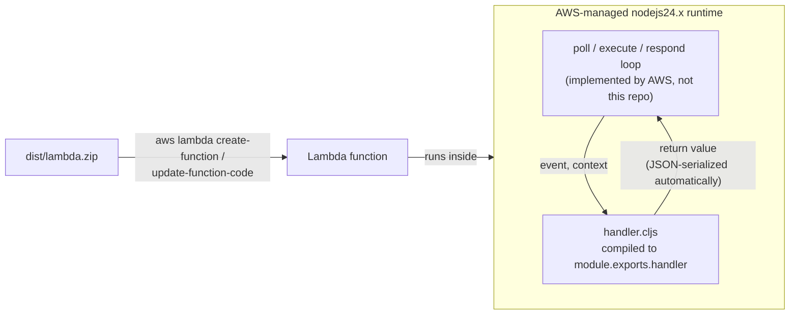

# lambda-mvp-cljs: ClojureScript on AWS Lambda's managed nodejs24.x runtime

Run a [ClojureScript](https://clojurescript.org) handler on AWS Lambda
using AWS's own **managed `nodejs24.x` runtime**, not a custom one. This
is the third sibling in the `lambda-mvp-*` family: where
[lambda-mvp-jlt](https://github.com/b12n-oss/lambda-mvp-jlt) (Jolt)
implements the Lambda Runtime API contract directly as a
`provided.al2023` zip, and
[lambda-mvp-jnk](https://github.com/b12n-oss/lambda-mvp-jnk) (jank) does
the same inside a container image, this project needs none of that: a
managed runtime already runs the poll/execute/respond loop internally, so
the entire deployable is a `shadow-cljs`-compiled handler function and a
zip. See [docs/guide/managed-runtime.md](docs/guide/managed-runtime.md)
for the full architecture writeup.

## Status

Early release, same caveat as both siblings: pin a commit or tag if you
depend on current behavior.

## How it works



- `src/main/net/b12n/lambda_mvp/handler.cljs`: the demo handler --
  greeting + raw-event echo + warm-invocation counter, same
  message/runtime/request_id/warm_invocation/event field shape as the
  Jolt/jank siblings' handlers. See
  [docs/guide/managed-runtime.md](docs/guide/managed-runtime.md) for the
  `unchecked-get` gotcha this handler's `context.awsRequestId` access
  depends on.
- `shadow-cljs.edn`: the `:node-library` build, `:exports {:handler ...}`
  compiling straight to `module.exports.handler`.
- `script/aws_lifecycle.clj`: create-or-update / invoke / teardown for
  the deployed function, driven entirely by whatever the caller's `aws`
  CLI already has configured.
- `script/bench_run.clj` + `script/bench.clj`: the cold/warm boot-time
  benchmark, reusing the Jolt/jank siblings' parsing and formatting logic
  verbatim.
- `script/demo.clj`: build + deploy + invoke in one go, with every
  prerequisite checked first.

## Requirements

- [Node.js](https://nodejs.org) -- locally verified against v24.8.0, but
  that's not a hard floor; `shadow-cljs` itself determines the actual
  minimum supported version.
- `npm`, `zip`.
- [babashka](https://babashka.org) -- every task below is `bb <task>`.
- AWS CLI v2.
- An AWS account and credentials the `aws` CLI can already use
  (`AWS_PROFILE`/`AWS_REGION` env vars, or `aws configure`). Nothing in
  this repo hardcodes a profile, account, or region.

## Quickstart

```sh
bb build       # shadow-cljs release -> dist/lambda.zip
bb smoke       # local smoke: invoke the compiled handler with a canned event (no AWS)
bb test        # run script/bench.clj's unit tests
bb demo        # build + deploy + invoke in one go, prerequisites checked first
bb deploy      # idempotent: IAM role + Lambda function, create or update
bb invoke      # single ad-hoc invoke, prints response + REPORT line
bb bench       # cold/warm boot-time comparison across memory tiers
bb teardown    # delete the function + role when you're done
bb clean       # remove build artifacts
```

`bb deploy`'s function name (`lambda-mvp-cljs`) and IAM role name
(`lambda-mvp-cljs-role`) are overridable via `LAMBDA_MVP_FUNCTION_NAME`.
Deploys to `arm64` by default (`LAMBDA_ARCH=x86_64` to switch); unlike the
Jolt/jank siblings there's no native binary to build per architecture, so
this is a free choice rather than something read off a compiled artifact.

## Cold vs. warm boot time

See [docs/guide/cold-warm-boot.md](docs/guide/cold-warm-boot.md) for the
real, same-account/same-region/same-day comparison across all three
`lambda-mvp-*` siblings, along with the honest caveats about what it does
and doesn't prove: three different deployment models sitting side by
side, not a clean single-variable comparison.

## Extension points

Not built here, but straightforward follow-ups if you need them:

- A custom Runtime API implementation in cljs/Node, for a stricter
  "same contract, three languages" comparison than this project's
  managed-runtime shape allows.
- A function URL + bearer token, for an HTTP-reachable demo instead of
  `aws lambda invoke` only.
- A handler workload with a real npm runtime dependency, to actually
  exercise the "npm deps aren't bundled by shadow-cljs" gotcha
  `docs/guide/managed-runtime.md` describes rather than merely naming it.

## References

- [lambda-cljs](https://github.com/thheller/lambda-cljs) -- the
  canonical ClojureScript-on-Lambda reference this project's deployment
  pattern follows directly.
- [lambda-mvp-jlt](https://github.com/b12n-oss/lambda-mvp-jlt) (the Jolt
  sibling) · [lambda-mvp-jnk](https://github.com/b12n-oss/lambda-mvp-jnk)
  (the jank sibling)
- [AWS Lambda Node.js runtime](https://docs.aws.amazon.com/lambda/latest/dg/lambda-runtimes.html)
- [docs/guide/cold-warm-boot.md](docs/guide/cold-warm-boot.md) -- the
  real three-way comparison

## License

EPL 2.0, see `LICENSE`.
